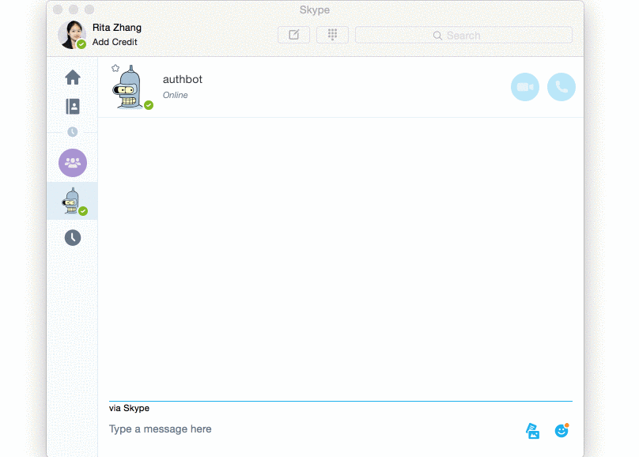

# AuthBot for Node.js with Microsoft Bot Framework

_A bot that authenticates users and get profile information and the latest email for the logged in user_.

[Checkout out the bot on Skype](https://join.skype.com/bot/dce91571-f312-4395-8602-91a145d1f52a)


[Check out the demo site](https://authbot.azurewebsites.net/)

This bot enables users to authenticate with their Microsoft id and/or their AD domain. Then the bot uses the accesstoken to retrieve the latest email for the user.


## Features
* Support endpoints V1 (only supports AD accounts)
* Support endpoints V2 (now supports both AD accounts and Microsoft accounts)

Allow easy and secure sign in, even in chat sessions including multiple users

## Installation

Clone this repo and then install dependencies:

    git clone https://github.com/CatalystCode/node-authbot.git
    cd node-authbot
    git checkout master
    npm install

Push directly to Azure Web App:
     The [dev branch](https://github.com/CatalystCode/node-authbot/tree/dev) has been setup to push directly to Azure web app

Setup the bot:
* Populate environment variables in [.env.template](.env.template).
* Follow the instructions on [Bot Framework website](https://dev.botframework.com/bots) to setup Channels.
* [Optional] If the bot is hosted on Azure App Service, make sure to increase the `maxQueryString` limit by updating the `web.config` file in `$HOME/site/wwwroot` like this:

```
<security>
	  <requestFiltering>
	  	<requestLimits maxQueryString="10000"/>
	  	...
	  </requestFiltering>
</security>

```

## Acknowledgement
Many thanks to [@sozercan](https://github.com/sozercan) and [@GeekTrainer](https://github.com/GeekTrainer) for your contribution.


## License
Licensed using the MIT License (MIT); Copyright (c) Microsoft Corporation. For more information, please see [LICENSE](LICENSE).
