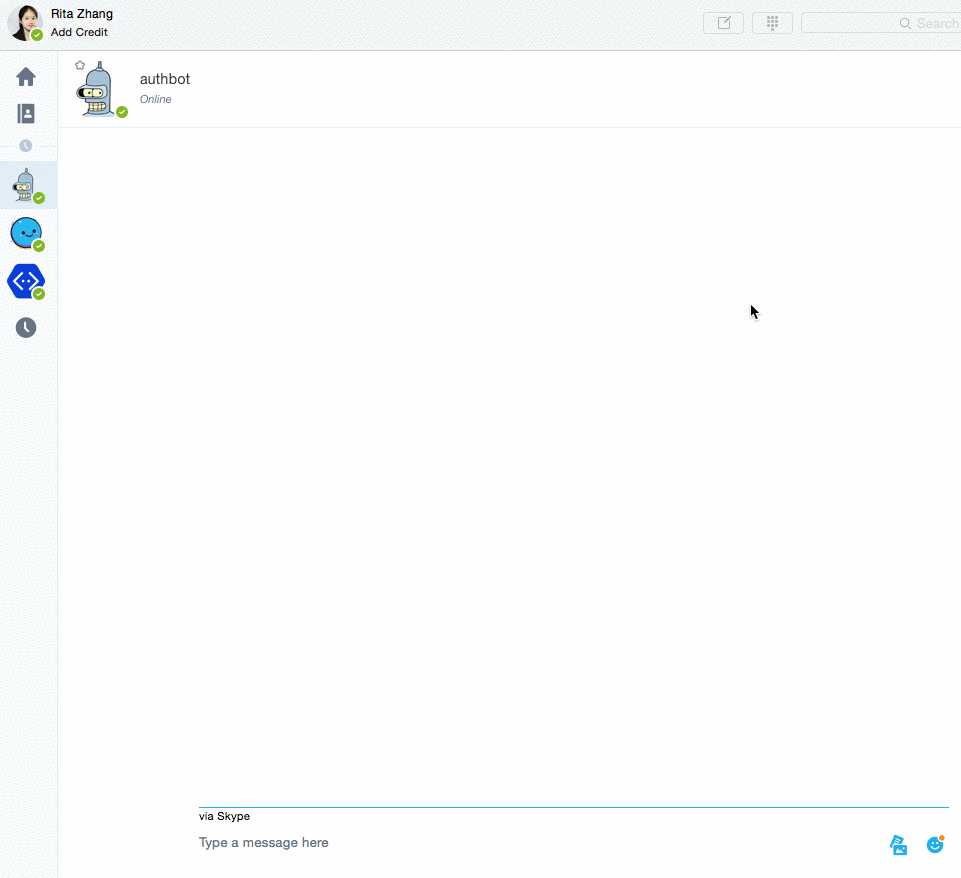

# AuthBot for Node.js with Microsoft Bot Framework

_A bot that authenticates users and get profile information about the user_.

[Check out the demo site](https://authbot.azurewebsites.net/)

This bot enables users to authenticate with their Microsoft id and/or their AD domain.

## Features
* Support endpoints V1 (only supports AD accounts)
* Support endpoints V2 (now supports both AD accounts and Microsoft accounts)

Allow easy and secure sign in, even in chat sessions including multiple users

## Installation

Clone this repo and then install dependencies:

    git clone https://github.com/CatalystCode/node-authbot.git
    cd node-authbot
    git checkout master
    npm install

Push directly to Azure Web App:
     The [dev branch](https://github.com/CatalystCode/node-authbot/tree/dev) has been setup to push directly to Azure web app

Setup the bot:
* Update [env.template.sh](env.template.sh) with our keys, then run it to set those environment variables. NOTE: Please do not check this file into your final application repo.
* Follow the instructions on [Bot Framework website](https://dev.botframework.com/bots) to setup Channels.

## Acknowledgement
Many thanks to [@sozercan](https://github.com/sozercan) and [@GeekTrainer](https://github.com/GeekTrainer) for your contribution.

## License
Licensed using the MIT License (MIT); Copyright (c) Microsoft Corporation. For more information, please see [LICENSE](LICENSE).
